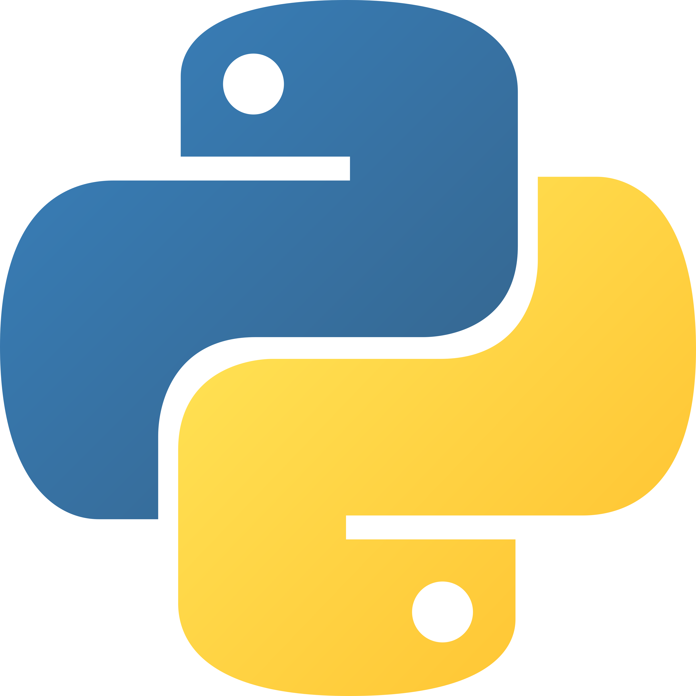

<div align="center">

<!-- HERO -->
<br/>

```
╔══════════════════════════════════════════════════════════╗
║              UZBEKISTAN · FULLSTACK DEVELOPER            ║
╚══════════════════════════════════════════════════════════╝
```

      

# AXMADJON QAXXOROV

**`Backend Architecture · API Design · Modern Web Systems`**

<br/>

[](https://github.com/qaxxorovxd)
[](https://pypi.org/user/qaxxorovxd/)
[](https://www.youtube.com/@qaxxorovxd)
[](https://t.me/qaxxorovxd)
[](https://beacons.ai/qaxxorovxd)

</div>

<br/>

---

## `01` — ABOUT

> *"Consistency beats motivation. I build every day."*

I build high-performance applications across the **Node.js** and **Python** ecosystems —
combining clean UI principles with scalable backend logic.

Relational & NoSQL databases · REST APIs · Telegram bots · Linux-based environments.
I publish open-source packages on PyPI and create programming content in Uzbek on YouTube.

---

## `02` — SPECIALIZATION

| Area | Focus |
|---|---|
| **API Development** | RESTful architecture, API-first design |
| **Telegram Bot Systems** | Production-grade logic, commerce bots |
| **Admin Panels & Dashboards** | High-performance management interfaces |
| **Authentication Systems** | JWT, OAuth2, RBAC, security hardening |
| **Database Design** | Schema design, indexing, query tuning |
| **Fullstack Web Apps** | End-to-end product development |
| **Automation & Scripts** | Linux, VPS provisioning, deployment |

---

## `03` — TECH STACK

<div align="center">
 &nbsp;&nbsp;&nbsp;

</div>

<br/>

**Backend**
```
Python · Node.js · FastAPI · Express.js · SQLAlchemy · aiogram
```

**Frontend**
```
React · Next.js · JavaScript · Tailwind CSS · shadcn/ui · HTML5 · CSS3
```

**Database & Infrastructure**
```
PostgreSQL · MongoDB · SQLite · Linux · Nginx · Git
```

---

## `04` — FEATURED PROJECT

### [`rapidauth`](https://pypi.org/project/rapidauth/) — Authentication Framework for FastAPI

[](https://pypi.org/project/rapidauth/)
[](https://pypi.org/project/rapidauth/)
[](https://pypi.org/project/rapidauth/)

A plug-and-play authentication framework. One `include_router` call mounts **14 auth endpoints** automatically.

```bash
pip install rapidauth
```

```python
from fastapi import FastAPI
from rapidauth import RapidAuth
from models import User

app  = FastAPI()
auth = RapidAuth(user_model=User, jwt_secret="your-secret-min-32-chars")
app.include_router(auth.router)
```

**Features:**

```
— JWT access + refresh tokens with rotation & blacklist
— Tortoise ORM and SQLAlchemy (async/sync) support
— Email verification & password reset via SMTP
— OAuth2: Google, GitHub, Discord
— Role-Based Access Control (RBAC)
— Rate limiting & brute-force protection
— Bcrypt / Argon2 password hashing
```

---

## `05` — YOUTUBE

[**@qaxxorovxd**](https://www.youtube.com/@qaxxorovxd) — Programming tutorials in Uzbek:

`Node.js` · `JavaScript` · `Python` · `aiogram` · `FastAPI` · `Telegram bots`

---

## `06` — CONTACT

<div align="center">

| | |
|:---:|:---:|
| **All links** | [beacons.ai/qaxxorovxd](https://beacons.ai/qaxxorovxd) |
| **YouTube** | [@qaxxorovxd](https://www.youtube.com/@qaxxorovxd) |
| **Telegram (channel)** | [@qaxxorovxd](https://t.me/qaxxorovxd) |
| **Telegram (direct)** | [@akhmedbeyy](https://t.me/qaxxorovxddev) |
| **PyPI** | [pypi.org/user/qaxxorovxd](https://pypi.org/user/qaxxorovxd/) |
| **Email** | `axmadjonqaxxorovc@gmail.com` |

</div>

---

<div align="center">

```
CLEAN CODE · STRUCTURED LOGIC · SCALABLE SYSTEMS · LONG-TERM THINKING
```


</div>
